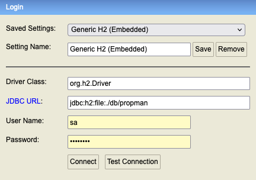

# Property Management Application Network- PROPMAN

Property Management Application Network (PROPMAN) is a GraphQL enabled property management application.
Properties like hotel, can be created, updated, retrieved and deleted using this application. 
The data comes in through the GraphQL endpoint will eventually be stored in to the H2 database.

## ✉️ Support / Contributions
This application is maintained by [Deepesh](mailto::deepeshdarshan@gmail.com)


## 🔧 Installation

How build & run this project?

### Requirements

You need Java 17 configured. 
Confirm you are using the correct JDK version

   ```
   echo $JAVA_HOME
   java -version
   ```

### Build locally

You need maven >= 3.9.x. Run the following command to build the application

```
mvn clean install
```

Alternatively, you can also build the project via the IDE, e.g. IntelliJ provides integration with Maven via a dedicated plugin.
## Run locally

### Using IntelliJ IDEA

Configure a new spring boot application, set this as the main class
`com.eh.propman.app.PropmanApplication`,
then start the application.

### GraphQL console

URL: [http://localhost:8080/playground](http://localhost:8080/playground)

### Sample queries

#### Mutation

``` 
mutation create_property {
  createProperty(
    request: {
      rating: 5
      preference: 1
      name: "Holiday Inn"
      price: 5400
      type: 105
      url: "https://cdn1.goibibo.com/gi_dyn/t_fs/https://i.travelapi.com/lodging/4000000/3610000/3601000/3600948/e66ae738_z.jpg"
      description: "test"
    }
  ) {
    id
    name
    rating
    preference
    type {
      name
    }
  }
}
```

#### Query

```
query {
  search_results: searchProperty (
    request: {  name: "holiday"}
  ) {
    id
    name
    rating
    preference
    type {
      id
      name
    }
  }
}
```

### H2 console

URL: [http://localhost:8080/h2](http://localhost:8080/h2)

Fill in the values as per the screenshot. You will get the`password`from [h2.yml](./propman-infra/src/main/resources/h2.yml)


